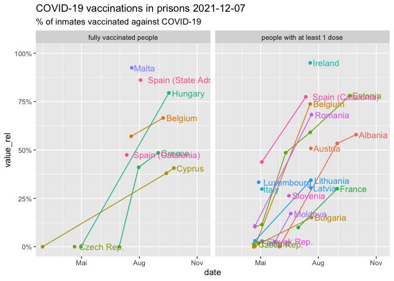

# COVID: How Europe’s prisons have fared in the pandemic

Prisons make fertile breeding grounds for viruses, yet administrations
have revealed little about COVID-19 cases, deaths and vaccinations in
Europe’s prisons. Data from 29 countries show the pandemic’s impact on
prisons.

This project is a collaboration within the [European Data Journalism
Network](https://www.europeandatajournalism.eu/).

**Project lead:** [Deutsche
Welle](https://www.dw.com/en/data/t-43091100)

**Collaborators:** [Alternatives
Economiques](https://www.alternatives-economiques.fr/),
[Civio](https://civio.es/), [El
Confidencial](https://www.elconfidencial.com/),
[EUrologus](https://index.hu/kulfold/eurologus/), [Il
Sole24Ore](https://www.ilsole24ore.com/), [iMEdD](https://imedd.org/),
[MIIR](https://miir.gr/), [OBC
Transeuropa](https://www.balcanicaucaso.org/),
[Openpolis](https://www.openpolis.it/), [Pod črto](https://podcrto.si/),
[VoxEurop](http://voxeurop.eu/)

*In this repository, you will find methodology, data and code behind
this investigation.*

**Read the articles that came out of this collaboration:**

Links will be added as articles are published

-   DW.com: “COVID: How Europe’s prisons have fared in the pandemic”
    [English](https://www.dw.com/a-60006262) \|
    [Albanian](https://p.dw.com/p/43se9) \|
    [German](https://www.dw.com/a-60006746) | [Greek](https://www.dw.com/a-60028764) | [Serbian](https://www.dw.com/a-60030103)
- European Data Journalism Network: "Locked up: Covid-19 and prisons in Europe" [English](https://www.europeandatajournalism.eu/eng/Investigations/Locked-up-Covid-19-and-prisons-in-Europe)

**This repository is maintained by:** [Kira
Schacht](https://twitter.com/daten_drang)

# Files

| Name                              | Content                                                                                 |
|-----------------------------------|-----------------------------------------------------------------------------------------|
| `Database Prisons and Covid.xlsx` | The main database used for this project                                                 |
| `scripts/prisons.Rmd`             | The main R markdown script. Run in RStudio to reproduce this analysis.                  |
| `scripts/data.RData`              | The R Data file containing the datasets imported and created using the analysis script. |
| `data/...`                        | Other data files used for this analysis                                                 |
| `graphics/...`                    | Finalized graphics that came out of this analysis                                       |

# Data sources

Much of the data we use is collated from various sources and collected
for this project by the collaborators.

Notable sources include:

For prison populations and capacities, as well as case numbers, up to
September 2020:

-   Aebi, M. F., & Tiago, M. M. (2021). [SPACE I - 2020 – Council of
    Europe Annual Penal Statistics: Prison
    populations](https://wp.unil.ch/space/space-i/annual-reports/).
    Strasbourg: Council of Europe
-   Aebi, M. F. & Tiago, M. M. (2020). [Prisons and Prisoners in Europe
    in Pandemic Times: An evaluation of the medium-term impact of the
    COVID-19 on prison
    populations](https://wp.unil.ch/space/publications/2199-2/).
    Strasbourg: Council of Europe.

For measures taken in prisons to curb the spread of COVID-19, up to
August 2020:

-   Güerri C, Martí M, Pedrosa A. (2020). [Las prisiones ante el
    COVID-19. Medidas adoptadas por
    país.](https://covid19prisons.wordpress.com/measures/)

Data on cases, deaths, and vaccinations were augmented using the
following sources:

-   [EuroPris: COVID-19 Feedback
    Collection](https://www.europris.org/file/13548/)
-   [World Prison Brief](https://www.prisonstudies.org/map/europe)
-   Various national and regional sources, e.g. the local Ministries of
    Justice or prison administration

Data on pandemic measures and were augmented using the following
sources:

-   [EuroPris (2021): COVID-19 Feedback
    Collection](https://www.europris.org/file/13548/)
-   [EuroPris (2021): Prevention measures in European Prisons against
    COVID-19](https://www.europris.org/covid-19-prevention-measures-in-european-prisons/)
-   [Prison Insider (2020): Europe: coronavirus, prison
    fever](https://www.prison-insider.com/en/articles/europe-coronavirus-la-fievre-des-prisons)

You can find detailed information on the source of each data point in
the project database, which you can find in the Excel file in this
repository, as well as in this [Google
Sheet](https://docs.google.com/spreadsheets/d/11tNCMg1vkXedOKbMcU30dtHNOsqQmtBx-ejMHd2sZ9M/edit#gid=1438591309).

The base countries included in this analysis are the EU-27 we could find
information on. Non-EU countries in Europe were added when of interest
to the analysis.

# Analysis

1.  Read data
2.  Data overview
3.  Consolidate regional data
4.  Check non-cumulative data points
5.  Relative and absolute cases / deaths
6.  Vaccination progress
7.  Prison population and overcrowding

# 1 Read data

-   Read cases/deaths data `d`

-   Join with vaccination progress data `d_vax`

-   Read prison population data `d_pop`

-   Data on cases, deaths and vaccinations in the general population
    `covid_pop`. (**Source:** [Our World in
    Data](https://ourworldindata.org/explorers/coronavirus-data-explorer),
    extracted on 2021-11-21)

-   Filter all datasets for countries included in analysis

# 2 Data overview

Main dataset columns:

    ##  [1] "country"                     "level"                      
    ##  [3] "region"                      "date"                       
    ##  [5] "period"                      "cases_inmates"              
    ##  [7] "deaths_inmates"              "cases_staff"                
    ##  [9] "deaths_staff"                "people with at least 1 dose"
    ## [11] "administered doses"          "fully vaccinated people"

Chart of available data points:


Number of countries by geographic levels of data:

``` r
d %>% group_by(level) %>% summarize(n = length(unique(country))) %>% knitr::kable()
```

| level      |   n |
|:-----------|----:|
| individual |   1 |
| national   |  35 |
| regional   |   4 |

4 countries have regional data that might need to be aggregated to the
national level:

``` r
d %>% filter(level == "regional") %>% `$`(country) %>% unique
```

    ## [1] "Germany"            "Greece"             "Italy"             
    ## [4] "Spain (State Adm.)"

# 3 Consolidate regional data

Data needs to be aggregated if regional data is not available on the
national level for the same dates. That is the case for the following
countries:

``` r
d %>% 
  group_by(country, date) %>%
  filter("regional" %in% level) %>% 
  mutate(agg = !("national" %in% level)) %>% 
  group_by(country) %>% 
  summarise(agg = any(agg)) %>% knitr::kable()
```

| country            | agg   |
|:-------------------|:------|
| Germany            | TRUE  |
| Greece             | FALSE |
| Italy              | FALSE |
| Spain (State Adm.) | TRUE  |

Of the 4 countries with regional data, Germany and Spain (State Adm.)
have to be summed up to provide national figures.

About the regional data:

-   regional data for `Germany` includes regional data for all 16
    states, although in varying levels of detail
-   regional data for `Spain (State Adm.)` includes regional data for 18
    autonomous cities and communities of Spain, excluding Catalonia, for
    these 4 points in time:
    `2020-06-21, 2020-12-31, 2021-03-31, 2021-08-03`.

## Plot case numbers by time and region for Germany

To see how complete a picture the regional data for Germany provide, we
check to see whether the regions with the highest case numbers also
provided relatively frequent data updates.


-   **Spain:** data present for all regions for the same points in time
-   **Germany:** regions with higher case numbers have provide more data
    points, regions with only few available data points have relatively
    low numbers

Aggregating across regions should provide a reasonably complete picture
for Germany. Case numbers should be viewed as minimum case numbers for
any given point in time.

Vaccination data for Germany is only sporadically available and should
not be aggregated to the national level.

## Aggregate regional data to national level

-   Summarize data across regions

-   Append to complete datasets

# 4 Check non-cumulative data

Some countries did not report cumulative data, but instead only reported
data referring to specific time periods. These countries are:

``` r
d %>% filter(period != "cumulative") %>% group_by(country, period) %>%
  summarise(n = n(), min = min(date), max = max(date)) %>% knitr::kable()
```

| country | period |   n | min        | max        |
|:--------|:-------|----:|:-----------|:-----------|
| Albania | year   |   1 | 2021-09-30 | 2021-09-30 |
| Italy   | day    |   3 | 2020-04-15 | 2020-09-15 |
| Italy   | week   |  53 | 2020-11-22 | 2021-11-22 |
| Poland  | day    |   2 | 2020-12-29 | 2021-02-01 |

Italy, Poland and Albania provide non-cumulative data. For Italy and
Poland, this refers to active cases, which can’t be compared to new
positive tests at all. Albania only provides data for the year 2021.

This data can’t be compared to cumulative data points from other
countries and will not be aggregated.

# 5 Relative and absolute cases / deaths

## 5.1 Absolute cases/deaths

Plot national cumulative data over time, for countries with data points
in 2021.


-   France has the most cases among inmates and staff, followed by
    Spain, Germany, Hungary and Belgium.
-   Hungary has the highest death counts among inmates, although they’re
    still very low, followed, Spain.

## 5.2 Relative cases/deaths

For better comparison, we calculate the cases and deaths relative to the
prison population at the time. This can only effectively be done for
inmates, since data on the number of staff isn’t reliably available.

We pick the prison population size according to the closest reference
date from `d_pop`. The reference date is noted in the finished data set.

Plot relative cases / deaths over time:


**Latest infection rate among inmates by country:**

`value`: Cumulative number of cases on that date

`value_rel`: Cumulative share of inmates infected until that date

| country            | date       | value | value_rel |
|:-------------------|:-----------|------:|----------:|
| Croatia            | 2021-11-19 |   826 |     20.96 |
| Slovenia           | 2021-06-15 |   202 |     14.85 |
| Estonia            | 2021-09-20 |   329 |     14.48 |
| Belgium            | 2021-09-09 |  1255 |     12.40 |
| Spain (Catalonia)  | 2021-07-12 |   805 |     10.13 |
| Netherlands        | 2021-04-14 |   755 |      8.30 |
| Greece             | 2021-07-02 |   870 |      7.91 |
| France             | 2021-09-23 |  4872 |      7.45 |
| Hungary            | 2021-09-17 |  1357 |      7.43 |
| Sweden             | 2021-02-02 |   503 |      7.08 |
| Austria            | 2021-09-15 |   422 |      4.98 |
| Ireland            | 2021-09-17 |   177 |      4.70 |
| Norway             | 2021-04-19 |   139 |      4.58 |
| Spain (State Adm.) | 2021-08-03 |  2196 |      4.55 |
| Switzerland        | 2021-08-30 |   275 |      4.35 |
| Czech Rep.         | 2021-02-01 |   753 |      3.96 |
| Denmark            | 2021-07-26 |   149 |      3.52 |
| Albania            | 2021-02-28 |   161 |      3.19 |
| Luxembourg         | 2021-03-01 |    19 |      3.04 |
| Moldova            | 2021-06-18 |   166 |      2.58 |
| Germany            | 2021-09-09 |  1487 |      2.56 |
| Finland            | 2021-09-20 |    61 |      2.22 |
| Bulgaria           | 2021-01-07 |    53 |      0.82 |
| Italy              | 2020-04-09 |    58 |      0.11 |
| Cyprus             | 2021-05-17 |     0 |      0.00 |

Croatia, Slovenia, Estonia, Belgium and Spain have the highest relative
number of cases, with 10-15% of inmates infected.

The latest numbers for Croatia are from the fourth wave in November
2021, while the other figures are from before the fourth wave, so the
latest numbers from Croatia are not comparable with the latest numbers
of other countries. They are, however, an interesting indication that
cases might be rising during the fourth wave in other countries as well.

**Most recent number of deaths per 100,000 inmates by country:**

`value`: Cumulative number of cases on that date

`value_rel`: Cumulative share of inmates infected until that date

| country            | date       | value | value_rel |
|:-------------------|:-----------|------:|----------:|
| Croatia            | 2021-11-19 |     7 |      0.18 |
| Hungary            | 2021-09-17 |    15 |      0.08 |
| Bulgaria           | 2021-01-07 |     3 |      0.05 |
| Greece             | 2021-07-02 |     5 |      0.05 |
| Italy              | 2021-09-01 |    21 |      0.04 |
| Belgium            | 2021-09-09 |     3 |      0.03 |
| Spain (State Adm.) | 2021-08-03 |    10 |      0.02 |
| Austria            | 2021-09-15 |     1 |      0.01 |
| France             | 2021-09-23 |     5 |      0.01 |
| Germany            | 2021-09-09 |     3 |      0.01 |
| Denmark            | 2021-07-26 |     0 |      0.00 |
| Estonia            | 2021-09-20 |     0 |      0.00 |
| Finland            | 2021-09-20 |     0 |      0.00 |
| Ireland            | 2021-09-17 |     0 |      0.00 |
| Moldova            | 2021-06-18 |     0 |      0.00 |
| Slovenia           | 2021-06-15 |     0 |      0.00 |
| Spain (Catalonia)  | 2021-07-12 |     0 |      0.00 |

-   Croatia, Hungary, Greece and Bulgaria have the most deaths related
    to COVID-19, followed by Belgium and Spain.
-   Deaths numbers seem surprisingly low compared to the number of
    cases. Calculate the case fatality rate to learn more.

## 5.3 Case fatality rate

Pick latest date per country with case and death data available.
Calculate CFR (share of deaths in all cases).

| country            | date       | cases_inmates | deaths_inmates |   cfr |
|:-------------------|:-----------|--------------:|---------------:|------:|
| Kosovo             | 2021-09-21 |            50 |              3 | 0.060 |
| Bulgaria           | 2021-01-07 |            53 |              3 | 0.057 |
| Hungary            | 2021-09-17 |          1357 |             15 | 0.011 |
| Croatia            | 2021-11-19 |           826 |              7 | 0.008 |
| Greece             | 2021-07-02 |           870 |              5 | 0.006 |
| Spain (State Adm.) | 2021-08-03 |          2196 |             10 | 0.005 |
| Belgium            | 2021-09-09 |          1255 |              3 | 0.002 |
| Austria            | 2021-09-15 |           422 |              1 | 0.002 |
| Germany            | 2021-09-09 |          1487 |              3 | 0.002 |
| France             | 2021-09-23 |          4872 |              5 | 0.001 |
| Denmark            | 2021-07-26 |           149 |              0 | 0.000 |
| Estonia            | 2021-09-20 |           329 |              0 | 0.000 |
| Finland            | 2021-09-20 |            61 |              0 | 0.000 |
| Ireland            | 2021-09-17 |           177 |              0 | 0.000 |
| Moldova            | 2021-06-18 |           166 |              0 | 0.000 |
| Slovak Rep.        | 2020-12-22 |           743 |              0 | 0.000 |
| Slovenia           | 2021-06-15 |           202 |              0 | 0.000 |
| Spain (Catalonia)  | 2021-07-12 |           805 |              0 | 0.000 |

The case fatality rate is around 0.5% in the highest cases, and more
often below 0.05%. That seems suspiciously low considering the usual
COVID-19 death rates and the risk factors among prison population. It
might be an indicator of underreporting.

## 5.4 Compare cases and deaths with general population

To compare the situation in prisons with the situation in the countries
around them, we use general COVID-19-figures collated by [Our World In
Data](https://ourworldindata.org/coronavirus-data-explorer) and compare:

-   relative cases
-   relative deaths
-   case fatality rates

Leave out data for Croatia from November, since it’s not comparable to
earlier data from the other countries, which are from before the winter
2021 wave.

**Plot relative cases in prisons compared to the general population:**


**Plot relative deaths in prisons compared to the general population:**


Deaths are a lot lower than they are in the general population for all
countries.

**Plot case fatality rates in prisons compared to the general
population:**


The case fatality rate in prisons is only a fraction of that in the
general population, except for Bulgaria. It seems unlikely that case
fatality rates in prisons are actually this low. The more likely
hypothesis would be that deaths related to COVID-19 do not get reported
as reliably in prisons as they do in the general population.

# 6 Vaccination progress

# 6.1 Vaccination progress over time

Calculate share of inmates vaccinated like in 5.2.

Plot progress over time:



# 6.2 Compare vaccination progress to population

Compare vaccination rates among prisoners at the latest available point
in time with the rate in the general population like in 5.4


# 7 Prison population and overcrowding

To get a sense of how overcrowded prison systems were at the start of
the pandemic, and how things changed since then, we’ll take a closer
look at the prison population statistics over time.

## 7.1 Overcrowding at the start of the pandemic

Plot prison populations on January 1, 2020, versus official capacity.

One in three countries’ prison systems (10 of 34) was operating above
official capacity at the start of the pandemic.


## 7.2 Prison populations over time

Plot prison populations over time for each country:


Many countries released a lot of prisoners at the start of the pandemic.
But in many, populations are now rising again.

**Prison density at the latest available date:**

| country            | date       |  inmates | capacity | density | overcrowded |
|:-------------------|:-----------|---------:|---------:|--------:|:------------|
| Romania            | 2021-07-21 | 23000.00 | 18248.00 |    1.26 | TRUE        |
| Greece             | 2021-11-16 | 11179.00 | 10175.00 |    1.10 | TRUE        |
| Sweden             | 2021-10-01 |  7607.00 |  7027.00 |    1.08 | TRUE        |
| France             | 2021-06-30 | 65384.00 | 60618.00 |    1.08 | TRUE        |
| Italy              | 2021-11-01 | 53635.00 | 50574.00 |    1.06 | TRUE        |
| Cyprus             | 2020-09-15 |   716.00 |   680.00 |    1.05 | TRUE        |
| Belgium            | 2021-09-08 | 10119.00 |  9611.00 |    1.05 | TRUE        |
| Denmark            | 2021-04-15 |  4227.00 |  4085.00 |    1.03 | TRUE        |
| Slovenia           | 2021-09-13 |  1360.00 |  1327.00 |    1.02 | TRUE        |
| Croatia            | 2021-09-16 |  3941.00 |  3919.00 |    1.01 | TRUE        |
| Hungary            | 2021-09-15 | 18269.79 | 19031.03 |    0.96 | FALSE       |
| Austria            | 2021-07-20 |  8482.00 |  8880.00 |    0.96 | FALSE       |
| Moldova            | 2021-07-01 |  6423.00 |  6735.00 |    0.95 | FALSE       |
| Czech Rep.         | 2021-04-20 | 19000.00 | 19946.00 |    0.95 | FALSE       |
| Portugal           | 2021-10-01 | 11606.00 | 12618.00 |    0.92 | FALSE       |
| Finland            | 2021-01-01 |  2743.00 |  2997.00 |    0.92 | FALSE       |
| Malta              | 2021-02-01 |   821.00 |   927.00 |    0.89 | FALSE       |
| Slovak Rep.        | 2021-10-31 | 10274.00 | 11621.00 |    0.88 | FALSE       |
| Ireland            | 2021-07-26 |  3765.00 |  4285.00 |    0.88 | FALSE       |
| Luxembourg         | 2021-04-28 |   624.00 |   711.00 |    0.88 | FALSE       |
| Poland             | 2021-09-30 | 71291.00 | 82140.00 |    0.87 | FALSE       |
| Switzerland        | 2021-01-31 |  6316.00 |  7397.00 |    0.85 | FALSE       |
| Norway             | 2021-08-07 |  3034.00 |  3638.00 |    0.83 | FALSE       |
| Spain (Catalonia)  | 2021-06-01 |  7949.00 |  9560.00 |    0.83 | FALSE       |
| Albania            | 2021-08-01 |  5042.00 |  6106.00 |    0.83 | FALSE       |
| Germany            | 2020-12-31 | 58004.00 | 72385.00 |    0.80 | FALSE       |
| Netherlands        | 2020-09-15 |  9098.00 | 11850.00 |    0.77 | FALSE       |
| Bulgaria           | 2021-07-21 |  7100.00 |  9341.00 |    0.76 | FALSE       |
| Spain (Total)      | 2021-06-01 | 56166.00 | 75074.00 |    0.75 | FALSE       |
| Spain (State Adm.) | 2021-06-01 | 48217.00 | 65514.00 |    0.74 | FALSE       |
| Estonia            | 2021-07-20 |  2272.00 |  3097.00 |    0.73 | FALSE       |
| Lithuania          | 2021-07-20 |  5181.00 |  7326.00 |    0.71 | FALSE       |
| Latvia             | 2021-09-20 |  3124.00 |  4822.00 |    0.65 | FALSE       |
| Montenegro         | 2020-09-15 |   863.00 |  1333.00 |    0.65 | FALSE       |

10 of 34 countries still operate their prisons above their official
capacity according to the latest available data, the same number of
countries as at the beginning of 2020.

Of those with overcrowded prison systems at the start of the pandemic,
Hungary, the Czech Republic and Austria are now below 100% (but still
above 95%) of their official capacity. Sweden, Denmark and Croatia are
now overcrowded, even though they were not at the start of 2020.
